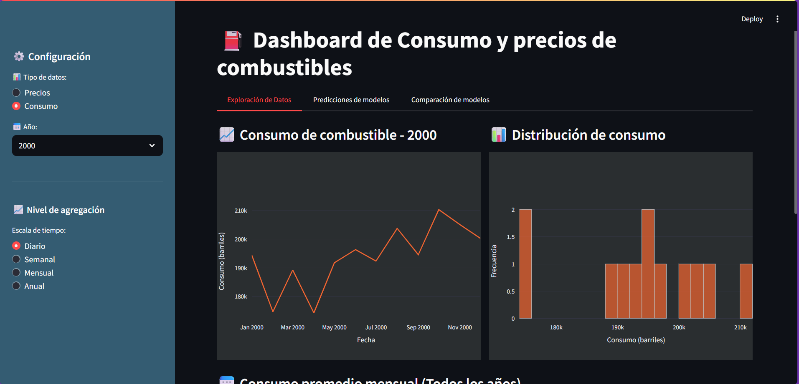
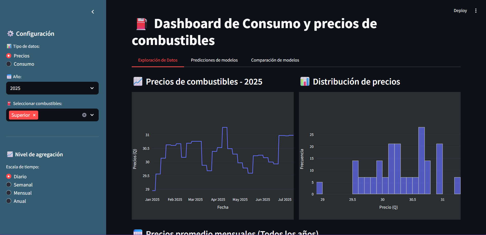
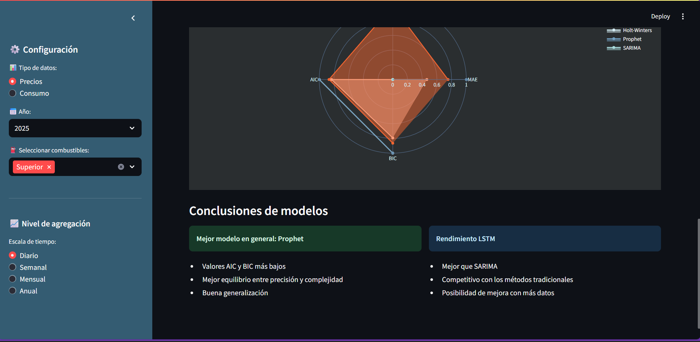
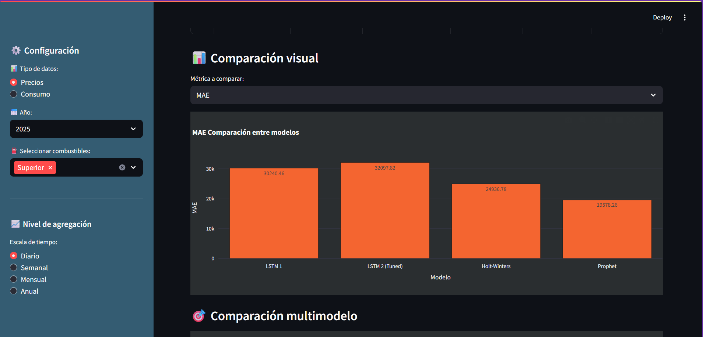
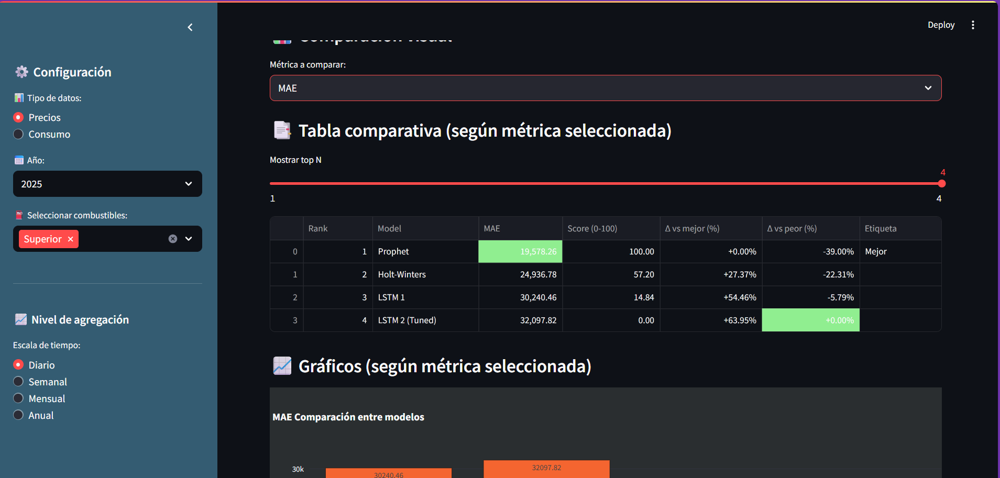

# How to run 🏃

```cmd
pip install streamlit pandas plotly openpyxl matplotlib
streamlit run app.py
```

# Resultados

#### DISCLAIMER: Si no se quiere correr el código fuente, se recomienda ver el video

Video de demostracion: [Video](https://youtu.be/YtrxQjrhrUk)






